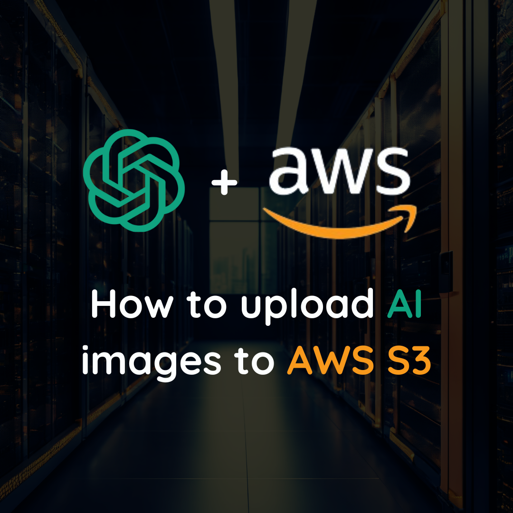

## Next.js + OpenAI + AWS S3

This repo demonstrates how to upload an image generated by OpenAI' API to an AWS S3 bucket in a Next.js app.



## Step-by-step guide

Login to your AWS console and create an [S3 bucket](https://console.aws.amazon.com/s3/). 
- Object Ownsership > ACLs enabled
- Uncheck "Block <i>all</i> public access"

Save the bucket name and AWS region in environment variables in a <b>.env.local</b> file.

```yaml
AWS_BUCKET_NAME=your-bucket-name
AWS_REGION=your-aws-region
```

In your AWS console, create an [IAM user](https://aws.amazon.com/iam/).
- Permissions options > Attach policies directly
- Select <b>AmazonS3FullAccess</b>

Create and save access keys for the IAM user.
- IAM > Users > <i>your-user</i>
- Create access key

Save the access key ID and secret key in <b>.env.local</b>.

```yaml
AWS_ACCESS_KEY_ID=your-access-key-id
AWS_SECRET_ACCESS_KEY=your-secret-access-key
```

Go back to your S3 bucket and update CORS permissions.
- Select your S3 bucket and go to Permissions
- Scroll down to CORS and click Edit
- Paste the following code and save

```bash
[
 {
     "AllowedHeaders": [
         "*"
     ],
     "AllowedMethods": [
         "GET",
         "PUT",
         "POST",
         "DELETE"
     ],
     "AllowedOrigins": [
         "*"
     ],
     "ExposeHeaders": []
 }
]
```

Sign in to your OpenAI API account and generate a new API KEY.
- API keys > Create new secret key
- Copy and paste the key to the <b>.env.local</b> file.

```bash
OPENAI_API_KEY=your-openai-api-key
```

Run the dev server.
```bash
npm run dev
```